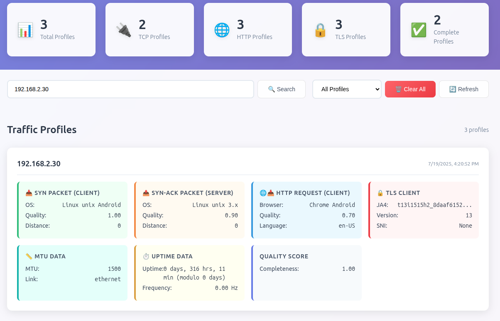

# Huginn Net Profiler

[](https://github.com/biandratti/huginn-net-profiler/actions/workflows/ci.yml)
[](LICENSE)
[](https://www.rust-lang.org/)

## Introduction

This project was built to provide an easy-to-use, web-based interface for testing and profiling TCP, HTTP and TLS connections using the [huginn-net](https://github.com/biandratti/huginn-net) library. The motivation behind this project is to enable researchers, network engineers, and enthusiasts to analyze  connection characteristics in real time, without the need for complex command-line tools or manual packet analysis.

By exposing the huginn-net library through a simple web application, users can:
- Instantly view detailed TCP, HTTP and TLS connection profiles for their own or specified IP addresses.
- Experiment with different network scenarios and observe how signatures and metadata change.
- Use the tool for demonstrations, or diagnostics in real-world environments.

This project aims to make advanced profiling accessible and interactive, helping users better understand network behaviors and improve their own tools or research.

## Architecture
```
huginn-net-profiler/
├── profiler/
│   ├── profile-assembler/    # Central data aggregation service
│   ├── tcp-collector/        # TCP fingerprinting collector
│   ├── http-collector/       # HTTP fingerprinting collector
│   └── tls-collector/        # TLS fingerprinting collector
├── deployment/               # Docker deployment configuration
└── static/                   # Web UI assets
```

## Modules

### profile-assembler
Central service that aggregates fingerprinting data from all collectors.
- REST API for profile management (`/api/profiles`, `/api/my-profile`)
- Real-time data ingestion from collectors
- Profile correlation by client IP address
- Statistics and health endpoints
- CORS support for web applications

### tcp-collector
Specialized collector for TCP fingerprinting using huginn-net.
- SYN packet analysis and OS detection
- SYN-ACK response profiling
- MTU discovery and uptime detection
- Sends data to profile-assembler via HTTP API

### http-collector
HTTP traffic analysis with client IP correlation.
- HTTP request/response fingerprinting
- Real client IP extraction from X-Real-IP headers
- User-Agent, Accept headers, and method detection
- Monitors Docker bridge network for internal traffic

### tls-collector
TLS handshake analysis and JA4 fingerprinting.
- TLS client hello analysis
- JA4 and JA4+ fingerprint generation
- SNI and ALPN extraction
- Cipher suite and extension profiling

## System Requirements

- Docker and Docker Compose
- Network interface access (requires privileged containers)
- Linux host (for network capture capabilities)

## Quick Start

### 1. Navigate to deployment directory
```bash
cd deployment/
```

### 2. Configure network interface
Edit `docker-compose.yml` to set your network interface:
```yaml
environment:
  - PROFILER_INTERFACE=your_interface_name  # e.g., eth0, wlan0
```

### 3. Deploy all services
```bash
docker-compose up -d --build
```

### 4. Access the application
- **Web interface**: https://huginn-net.duckdns.org (or your configured domain)
- **API**: https://huginn-net.duckdns.org/api
- **Traefik Dashboard**: http://localhost:8080

## Development Setup

### Build manually (without Docker)
```bash
cargo build --workspace --release
```

### Run individual collectors
```bash
# TCP collector (monitors host interface)
sudo ./target/release/tcp-collector --interface eth0

# HTTP collector (monitors Docker bridge)
sudo ./target/release/http-collector --interface br-xxxxx

# TLS collector (monitors host interface)  
sudo ./target/release/tls-collector --interface eth0

# Profile assembler (API server)
./target/release/profile-assembler
```

## Data Flow

```
External Client
    ↓ (TLS/TCP traffic)
Traefik (Reverse Proxy)
    ↓ (HTTP traffic)
Backend Services
    ↑                    ↑                    ↑
tcp-collector       http-collector      tls-collector
(host interface)   (Docker bridge)     (host interface)
    ↓                    ↓                    ↓
            profile-assembler (API)
                     ↓
              Web Client / API
```

### Traffic Monitoring Strategy
- **tcp-collector** and **tls-collector**: Monitor host interface (`wlp0s20f3`) to capture original client connections
- **http-collector**: Monitors Docker bridge network to capture internal HTTP traffic between Traefik and backends
- **Client IP correlation**: HTTP collector extracts real client IP from `X-Real-IP` headers added by Traefik
- **Profile assembly**: All data is correlated by client IP in the profile-assembler service

## UI as example


The web interface shows real-time network traffic analysis with detailed TCP, HTTP, and TLS profiling information for connected devices.
