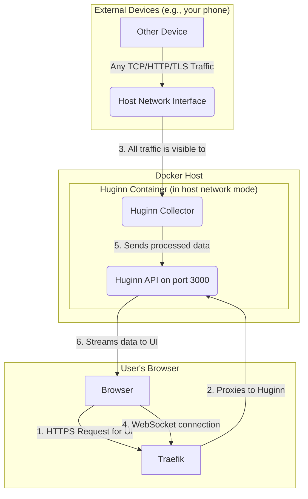

# Deployment with Docker Compose and Traefik

This document explains the architecture of the `docker-compose.yml` setup and how each service works together to capture and analyze network traffic.

## Core Concepts

- **Traefik:** Acts as the reverse proxy. It handles all incoming web traffic, manages TLS certificates, and routes requests to the correct service. For local development, it uses a self-signed certificate.
- **Huginn:** The main application container that runs the `huginn-api`. It serves the web frontend and also contains the `huginn-collector` logic to sniff network packets.
- **Host Network Mode:** The `huginn` service is configured with `network_mode: "host"`. This is the key to the whole setup. It means the container shares the host machine's network stack, allowing `huginn-collector` to listen directly on physical interfaces like `eth0` or `wlp0s20f3` and capture all traffic that the host sees.

## Architecture Diagram



## How It Works

### Data Flow for Traffic Collection
1.  Any device on your local network sends a packet (TCP, HTTP, or TLS). This packet arrives at the network interface of the machine running Docker (the "host").
2.  Because the `huginn` container is running in `host` network mode, its internal `huginn-collector` is listening directly on the host's network interface.
3.  The collector captures the packet, processes it through the `huginn-core` analyzer, and generates a traffic profile.
4.  This profile data is then available to be streamed to the web UI via the WebSocket connection.

### Accessing the Web UI
1.  You open `https://huginn.local.com` in your browser.
2.  The request goes to Traefik, which is listening on port 443 (HTTPS).
3.  Traefik terminates the TLS connection using its self-signed certificate and proxies the request to the `huginn` service on port 3000.
4.  The `huginn-api` serves the static HTML, CSS, and JavaScript files for the web interface.
5.  The JavaScript in your browser establishes a WebSocket connection back to the `huginn-api` (again, through Traefik) to receive the real-time traffic profiles.

## Running a Local Test

1.  **Configure Network Interface:** Open `docker-compose.yml` and find the `command` section for the `huginn` service. Change `--interface eth0` to match your host's active network interface (e.g., `wlp0s20f3`). You can find your interface name by running `ip link show` on your host.

2.  **Configure Hostname:** For local development, you need to tell your computer how to find `huginn.local.com`. Edit your `hosts` file (located at `/etc/hosts` on Linux and macOS) and add the following line:
    ```
    127.0.0.1    huginn.local.com
    ```

3.  **Start the Services:** Navigate to this `deployment` directory and run:
    ```bash
    docker-compose up --build
    ```

4.  **Access the Application:** Open your web browser and go to `https://huginn.local.com`. You will see a browser warning about an invalid certificate because it's self-signed. This is expected. Click "Advanced" and proceed to the site. You should now see the Huginn interface, capturing traffic from your network.
